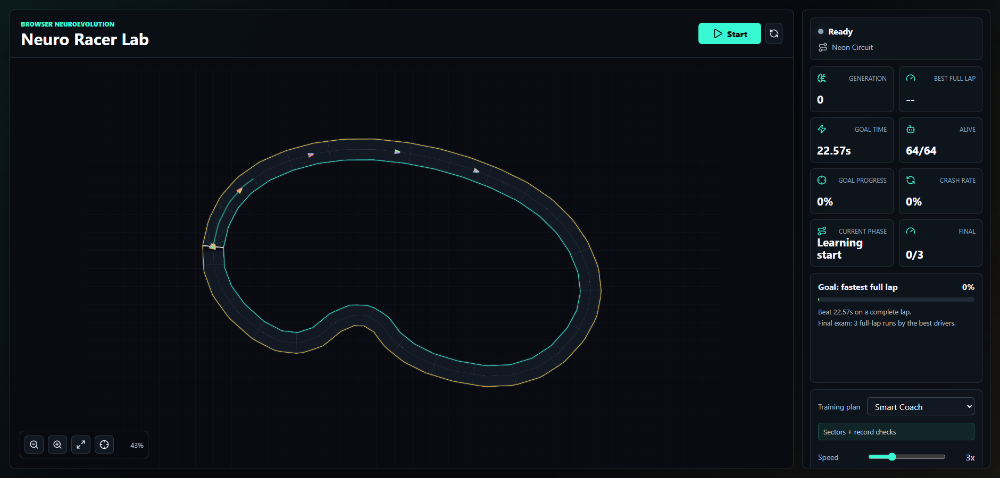
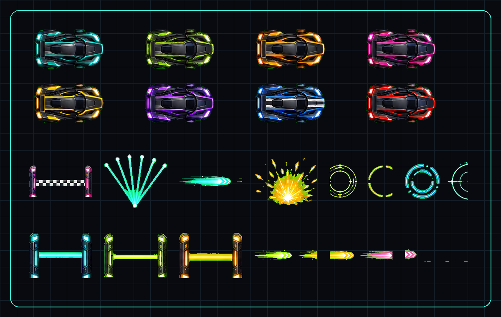

# Neuro Racer Lab

Interactive neuroevolution racing lab for the browser. Draw a custom track, let a population of neural drivers train on it, then run the fastest champion around a full lap.

[](https://github.com/Blizzeq/neuro-racer-lab/actions/workflows/ci.yml)
[](https://neuro-racer-lab.vercel.app)
[](https://www.typescriptlang.org/)
[](https://phaser.io/)
[](LICENSE)

**Live demo:** [neuro-racer-lab.vercel.app](https://neuro-racer-lab.vercel.app)  
**Repository:** [github.com/Blizzeq/neuro-racer-lab](https://github.com/Blizzeq/neuro-racer-lab)





## What It Does

Neuro Racer Lab is a public web demo where the user trains small neural-network cars to drive a drawn racing line as fast as possible.

- Draw or load a route on a real pan/zoom infinite canvas.
- The app generates road edges, checkpoints, spawn poses, sectors, and Matter Physics walls.
- Cars drive in parallel with ray sensors and a compact neural controller.
- A Smart Coach curriculum trains difficult sectors, validates full laps, and finishes with a final exam.
- The champion is the genome with the shortest completed full lap, not just the highest partial score.
- Save/load and JSON export/import preserve the track, training config, and best driver.
- Ghosts, heat traces, sector highlights, and live stats make the learning process visible.

## Training Goal

The goal is explicit: train the cars until one driver can finish the whole track quickly and consistently.

Smart Coach runs in phases:

1. **Learning start** - builds basic steering and forward progress.
2. **Sector practice** - starts cars from multiple parts of the track so long routes train faster.
3. **Hard corner practice** - focuses population pressure on the weakest sectors.
4. **Full lap validation** - regularly checks whether sector skills combine into a real lap.
5. **Record attempt** - tries to beat the current target lap time.
6. **Final exam** - confirms the champion over full-lap attempts.
7. **Training complete** - unlocks a champion run with the best driver.

The UI keeps the advanced genetic algorithm details out of the way by default. Users see the current phase, fastest lap, best full lap, sector coverage, hardest sector, crash rate, and final progress.

## How Learning Works

Each driver owns a JSON-compatible genome: a flat list of weights for a fixed neural network.

- **Inputs:** wall ray distances, speed, heading error to the look-ahead tangent, and upcoming turn curvature.
- **Network:** small MLP controller with steering and throttle outputs.
- **Fitness before a full lap:** forward progress, checkpoint progress, speed, sector completion, and safe wall clearance.
- **Fitness penalties:** crash, reversing, stagnation, and driving too close to walls.
- **Final ranking:** once a car completes a lap, shorter full-lap time wins.
- **Evolution:** elites are retained, the best historical driver seeds teacher mutations, strong parents cross over, and random immigrants keep exploration alive.

This is an interactive neuroevolution demo, not a formal reinforcement learning benchmark. The priority is a clear learning loop, strong visual feedback, and a convincing browser experience.

## Main Features

- Smart Coach default mode for long tracks and beginner-friendly training.
- Full Lap Race mode for simple start-to-finish training.
- Manual Lab mode for population and mutation experiments.
- Panzoom-powered infinite canvas with cursor-centered wheel zoom, fit-to-track, pan, and follow-best.
- Phaser 3.90 renderer with Matter Physics collisions.
- Ghost replay for the best full lap and sector attempts.
- Line heat overlay for frequently driven parts of the route.
- Local persistence through `localStorage`.
- Generated car sprites and reusable racing effects used by the simulator.
- Static Vercel deployment with no backend required.

## Tech Stack

- Vite 8
- React 19
- TypeScript 6
- Phaser 3.90 with Matter Physics
- `@panzoom/panzoom`
- `geneticalgorithm`
- Vitest
- Vercel static hosting

## Local Development

```bash
npm install
npm run dev
```

Open the Vite URL shown in the terminal.

## Scripts

| Command | Description |
| --- | --- |
| `npm run dev` | Start the local Vite dev server. |
| `npm test` | Run unit tests with Vitest. |
| `npm run build` | Type-check and build the static production site. |
| `npm run preview` | Preview the production build locally. |
| `npm run observe:training` | Launch Chrome, start training, and log 45 seconds of Smart Coach metrics through the debug hook. |
| `npm run smoke:ui` | Run a browser smoke test for zoom/fit, drawing, save/load, export/import, and starting training. |

## Training Observer

For tuning the learning loop, run the dev server in one terminal and the observer in another:

```bash
npm run dev
node scripts/observe-training.mjs --seconds=60 --mode=smartCoach --speed=8 --seed=qa-01
```

The observer launches the installed Chrome through `playwright-core`, clicks Start, and records phase, generation, alive cars, crash rate, best full-lap time, goal progress, record attempts, and sector coverage. Use the same `--seed` when comparing Smart Coach with `--mode fullLap` or `--mode manualLab`; run observers one at a time because parallel WebGL sessions can distort results.

For UI regression checks, keep the dev server running and execute:

```bash
npm run smoke:ui
```

## Project Structure

```text
src/
  components/       React UI and simulator shell
  lib/              track generation, genome, fitness, curriculum, export logic
  sim/              Phaser scene, physics, rendering, pan/zoom integration
public/            static assets
public/assets/     generated car sprites and reusable effect assets
docs/              README media
```

## Visual Assets

The current visual pack was generated for this project and stored as transparent game-ready assets:

- `public/assets/cars/*.png` - 8 transparent top-down car sprites used by racers in Phaser.
- `public/assets/effects/*.png` - checkpoint gates, sensor fans, boost streaks, sparks, and rings.
- `public/assets/manifest.json` - stable paths for reusing the generated assets elsewhere.
- `docs/neuro-racer-game-assets.png` - preview sheet for the generated asset pack.
- `public/og-image.png` - OpenGraph preview built from the useful asset pack.

## Deployment

The app is fully static and deploys directly to Vercel.

```bash
npm run build
npx vercel deploy --prod
```

Production: [https://neuro-racer-lab.vercel.app](https://neuro-racer-lab.vercel.app)

## GitHub About

Recommended repository metadata:

- **Description:** Interactive neuroevolution racing lab: draw a track, train neural cars, and run the fastest champion in the browser.
- **Website:** `https://neuro-racer-lab.vercel.app`
- **Topics:** `machine-learning`, `neuroevolution`, `genetic-algorithm`, `racing-game`, `phaser`, `matter-physics`, `react`, `typescript`, `vite`, `vercel`, `simulation`, `ai-demo`

## License

[MIT](LICENSE)
